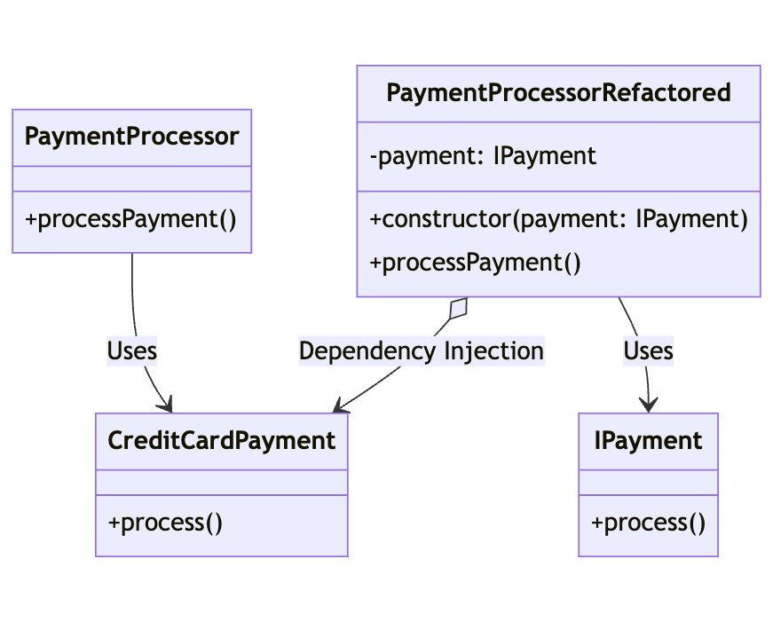

# Dependency Inversion Principle (DIP)

The Dependency Inversion Principle states that high-level modules should not depend on low-level modules. Both should depend on abstractions. Abstractions should not depend on details. Details should depend on abstractions.

## Explanation

The Dependency Inversion Principle (DIP) encourages the use of abstractions (interfaces or abstract classes) to decouple high-level modules from low-level modules. This allows for flexibility, modularity, and easier testing.

## Bad Example

In the bad example, we have a `PaymentProcessor` class that directly depends on a low-level `CreditCardPayment` class. This creates a tight coupling between the high-level module and the low-level implementation.

## Good Example

A better approach would be to define an abstraction (e.g., an `IPayment` interface) and have both the high-level `PaymentProcessor` and the low-level `CreditCardPayment` depend on the abstraction. This way, the high-level module can work with any implementation of the abstraction, providing more flexibility and decoupling.

## Diagram

The diagram shows a `PaymentProcessor` class depending directly on the `CreditCardPayment` class in the bad example. In the good example, both the `PaymentProcessor` and the `CreditCardPayment` depend on an abstraction (`IPayment` interface which is enforced by the developer).

## Conclusion

By following the Dependency Inversion Principle, we can design more flexible and maintainable code by decoupling high-level and low-level modules. This allows for easier testing, better modularity, and the ability to swap implementations without affecting the overall system.
