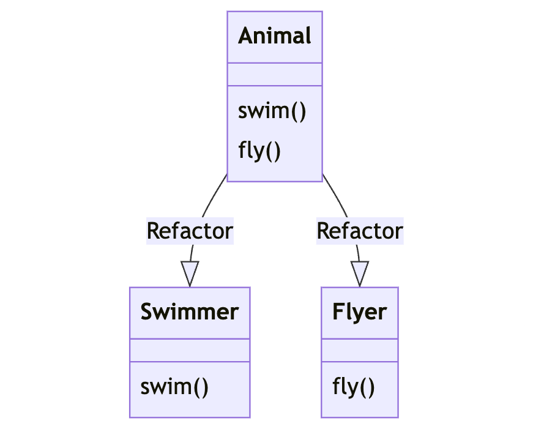

# Interface Segregation Principle (ISP)

The Interface Segregation Principle states that clients should not be forced to depend on interfaces they do not use. This means that larger interfaces should be split into smaller, more specific ones.

## Explanation

The Interface Segregation Principle (ISP) emphasizes that it is better to have multiple smaller interfaces that are focused and tailored to specific client needs, rather than having a single large interface that tries to cater to all possible scenarios.

## Bad Example

In the bad example, we have an `Animal` interface that has methods for both swimming and flying. However, not all animals can swim or fly. If a client depends on the `Animal` interface, it will be forced to implement both swimming and flying methods, even if it doesn't need them.

## Good Example

A better approach would be to split the `Animal` interface into smaller interfaces based on specific behaviors. For example, we can have separate interfaces for `Swimmer` and `Flyer`. This allows clients to depend only on the classes they actually need.

## Diagram

The diagram shows an `Animal` interface with methods for swimming and flying. In the bad example, the `Animal` class forces all clients to implement both swimming and flying methods. In the good example, the `Swimmer` and `Flyer` classes are more specific and tailored to individual needs.

## Conclusion

By following the Interface Segregation Principle, we can create interfaces that are focused, cohesive, and aligned with the needs of clients. This promotes better code organization, flexibility, and maintainability.
