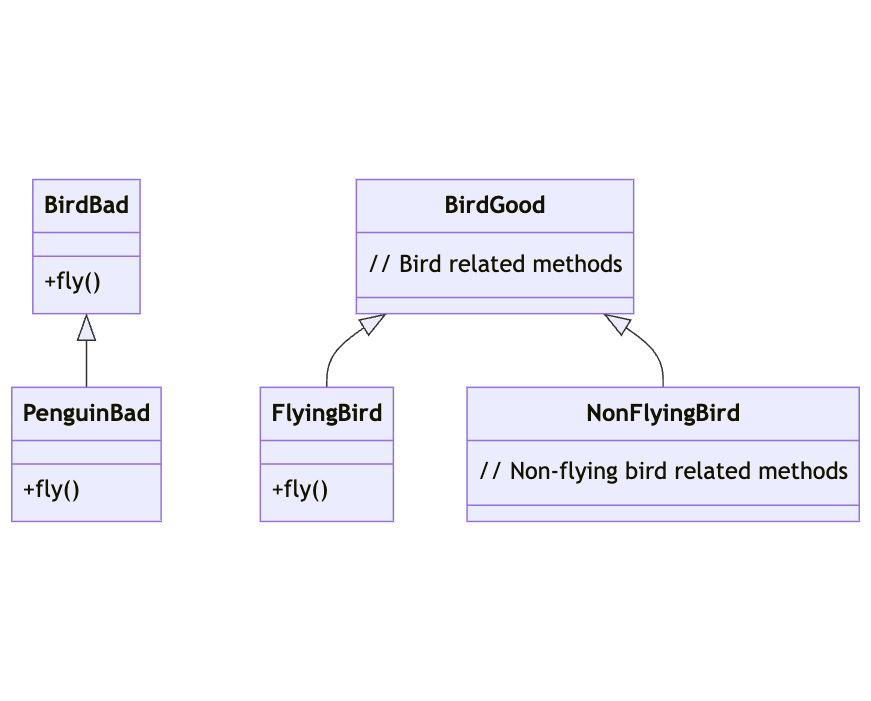

# Liskov Substitution Principle (LSP)

The Liskov Substitution Principle states that if a program is using a base class, it should be able to use any of its subclasses without the program knowing it. In other words, the objects of a superclass shall be replaceable with objects of a subclass without affecting the correctness of the program.

## Explanation

The Liskov Substitution Principle (LSP) is about subtyping and inheritance. It was introduced by Barbara Liskov in 1987. LSP extends the Open/Closed principle and enables you to replace objects of a parent class with objects of a subclass without breaking the application. This requires all subclasses to behave in the same way as the parent class.

## Bad Example

In the bad example, we have a `Bird` class and a `Penguin` class that extends `Bird`. The `Bird` class has a method `fly`, but penguins can't fly. If we create a function that lets any bird fly, it would break if we pass in a `Penguin` object.

## Good Example

A better approach would be to have a `Bird` class and separate classes for `FlyingBird` and `NonFlyingBird`. In the good example, we can create a function that lets any `FlyingBird` fly, and it won't break if we pass in a `NonFlyingBird` object.

## Diagram

The diagram shows a `Bird` class with a method for flying. In the bad example, the `Penguin` class extends `Bird`, but penguins can't fly. In the good example, we have separate classes for `FlyingBird` and `NonFlyingBird`.

## Conclusion

By adhering to the Liskov Substitution Principle, we can ensure that a subclass can stand in for its superclass without breaking the application. This makes the code more robust and less prone to errors.
