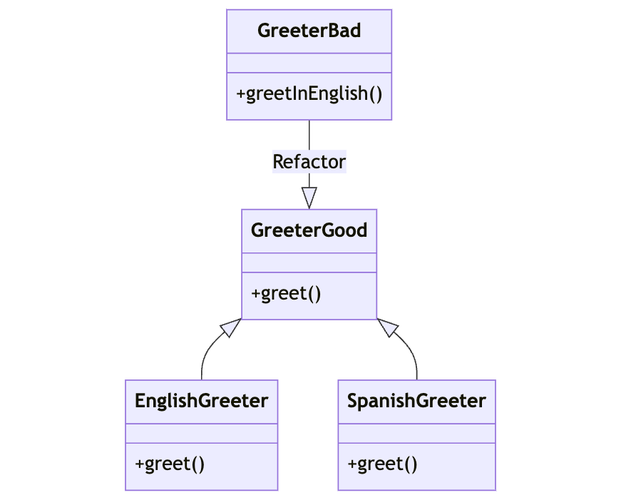

# Open-Closed Principle (OCP)

The Open-Closed Principle states that software entities (classes, modules, functions, etc.) should be open for extension but closed for modification. This means that you should be able to add new functionality to a system without changing existing code.

## Explanation

The Open-Closed Principle (OCP) promotes the use of interfaces or abstract classes, so that new functionality can be added by creating new classes that implement the interfaces or inherit from the abstract classes.

## Bad Example

In the bad example, we have a `Greeter` class that has a method for greeting in English. If we want to add a method for greeting in Spanish, we would have to modify the `Greeter` class.

## Good Example

A better approach would be to have a `Greeter` interface, and separate classes for each language. In the good example, if we want to add a new language, we can simply create a new class that extends `Greeter`. This adheres to the Open-Closed Principle because we can add new functionality without changing existing code.

## Diagram

The diagram shows a `Greeter` class with a method for greeting in English. In the bad example, if we want to add a method for greeting in Spanish, we would have to modify the `Greeter` class. In the good example, we have a `Greeter` interface, and separate classes for each language.

## Conclusion

By adhering to the Open-Closed Principle, we can make our code more flexible and easier to maintain. We can add new functionality without changing existing code, which reduces the risk of introducing bugs.
