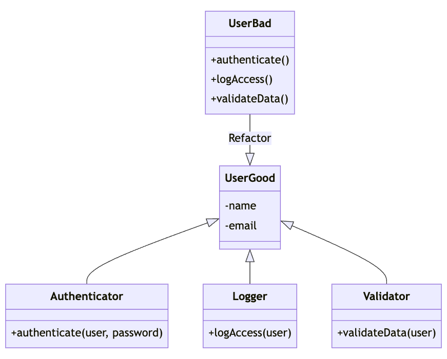

# Single Responsibility Principle (SRP)

The Single Responsibility Principle states that a class should have only one reason to change. This means that a class should have only one job or responsibility.

## Explanation

When a class has more than one responsibility, it becomes coupled. A change to one responsibility results in modification of the other responsibility. The Single Responsibility Principle (SRP) is a good way to manage this. It states that a class should have only one reason to change. If a class has more than one responsibility, it becomes coupled. A change to one responsibility results in modification of the other responsibility.

## Bad Example

In the bad example, we have a `User` class that has methods for authentication, logging, and data validation. This class has multiple responsibilities, making it more complex and harder to maintain.

## Good Example

A better approach would be to separate these responsibilities into different classes. In the good example, we have a `User` class that only contains user-related data. The responsibilities of authentication, logging, and data validation are handled by separate classes (`Authenticator`, `Logger`, and `Validator` respectively). This makes each class easier to understand, maintain, and extend.

## Diagram

The diagram shows a `User` class with multiple responsibilities. In the bad example, the `User` class handles authentication, logging, and data validation. In the good example, these responsibilities are separated into different classes: `Authenticator`, `Logger`, and `Validator`.

## Conclusion

By adhering to the Single Responsibility Principle, we can create classes that are easier to understand, maintain, and extend. Each class has a single responsibility, which makes the code more modular and flexible.
